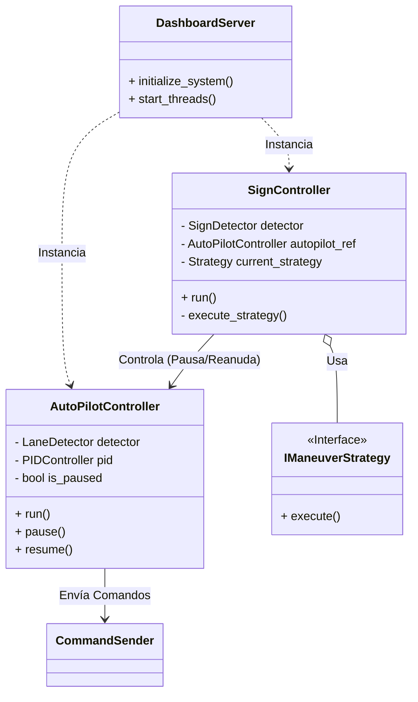
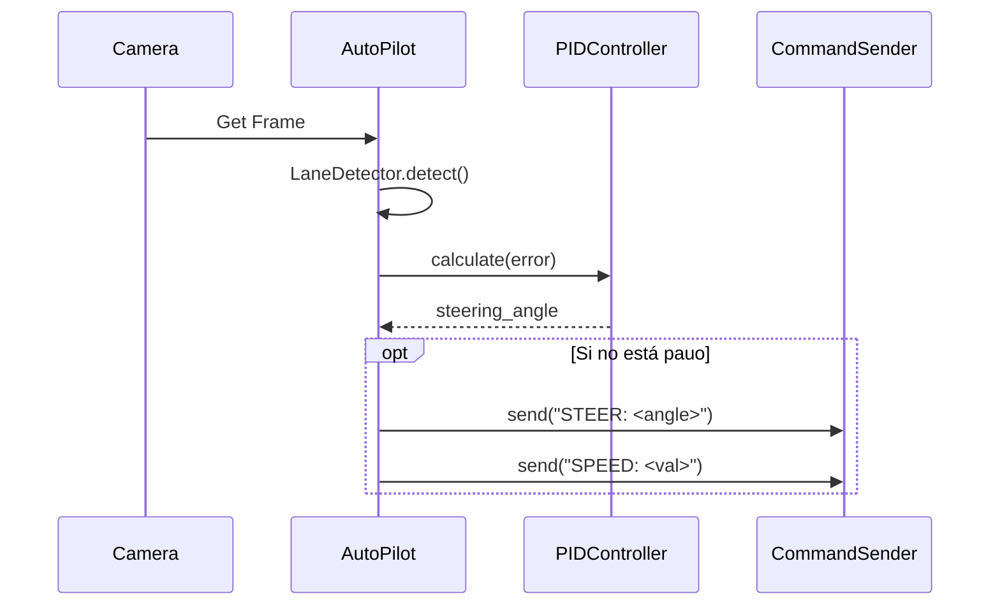

# Documento de Arquitectura de Software (SAD)

**Subsistema:** High-Level Computer Vision & Control ("The Brain")  
**Plataforma:** NVIDIA Jetson Orin Nano / Linux  
**Versión:** 1.0.0 (Current Implementation)  
**Fecha:** Noviembre 2025  

---

## 1. Visión General del Sistema

El módulo **Brain** es el componente de alto nivel encargado de la percepción y navegación autónoma. Se ejecuta sobre un sistema operativo Linux (Ubuntu/L4T) y su función principal es procesar flujos de video en tiempo real para mantener el vehículo en el carril y reaccionar ante señales de tráfico.

A diferencia del controlador de bajo nivel (ESP32), este sistema gestiona lógica compleja, visión artificial y la orquestación de maniobras temporales.

### 1.1 Principios de Diseño (v1.0)
La arquitectura actual se basa en **Controladores Paralelos con Dependencia Directa**.

* **Multithreading:** La detección de carriles y la detección de señales corren en hilos separados para maximizar el uso de los núcleos de la CPU/GPU.
* **Inyección de Dependencias:** El servidor del Dashboard actúa como fábrica, instanciando los controladores y pasando referencias entre ellos.
* **Control Jerárquico Directo:** El subsistema de Señalización tiene autoridad para interrumpir y controlar al subsistema de Navegación (Autopiloto).

---

## 2. Vista Estructural (Componentes)

El sistema se organiza en módulos funcionales que abstraen la visión, la lógica de control y el hardware.

### 2.1 Estructura de Directorios y Módulos

El código fuente sigue una estructura modular clara:

```text
brain/
├── dashboard/           # Capa de Presentación y Orquestación de Inicio
│   └── dashboard_server.py  (Entry Point & Dependency Injector)
├── lane_detection/      # Subsistema de Mantenimiento de Carril
│   ├── autopilot_controller.py (Bucle de Control PID)
│   ├── lane_detector.py        (Procesamiento de Imagen OpenCV)
│   └── pid_controller.py       (Cálculo matemático de dirección)
├── sign_vision/         # Subsistema de Reconocimiento de Objetos
│   ├── sign_controller.py      (Bucle de Detección YOLO)
│   ├── strategies/             (Patrón Strategy para Maniobras)
│   │   ├── stop_strategy.py
│   │   └── intersection_strategy.py
└── camera/              # Capa de Abstracción de Hardware (HAL)
    ├── video_streamer.py       (Webcams estándar)
    └── realsense_streamer.py   (Cámaras de Profundidad Intel)
```

### 2.2 Diagrama de Clases y Relaciones

Observe la relación directa donde `SignController` posee una referencia a `AutoPilotController`.



---

## 3. Lógica de Ejecución (Hilos y Procesos)

El sistema opera mediante tres hilos de ejecución principales que comparten memoria dentro del mismo proceso Python.

### 3.1 Hilo de Navegación (AutoPilot)
* **Frecuencia:** ~30 Hz (Limitado por FPS de cámara).
* **Responsabilidad:**
    1.  Obtener frame de `VideoStreamer`.
    2.  Procesar ROI (Región de Interés) para líneas de carril.
    3.  Calcular error de centro y ángulo PID.
    4.  **Si `!is_paused`:** Enviar comando de dirección al ESP32.
    5.  **Si `is_paused`:** Solo procesar imagen para visualización en Dashboard (Debug).

### 3.2 Hilo de Señalización (SignVision)
* **Frecuencia:** ~15-20 Hz (Dependiente de inferencia YOLO).
* **Responsabilidad:**
    1.  Inferencia de red neuronal sobre el frame.
    2.  Validación de **Confianza** (> 0.6) y **Distancia** (< 1.5m usando RealSense).
    3.  Si se detecta evento: **Tomar control exclusivo del CommandSender**.

---

## 4. Flujos de Comportamiento

### 4.1 Flujo Normal: Seguimiento de Carril
El vehículo opera en modo autónomo estándar.



### 4.2 Flujo de Interrupción: Detección de Señal (Patrón Strategy)
Este es el flujo crítico de la arquitectura v1.0. Cuando se detecta una señal compleja (ej. Intersección), el sistema de visión "secuestra" el control.

```mermaid
sequenceDiagram
    autonumber
    participant Sign as SignController
    participant Strat as IntersectionStrategy
    participant Auto as AutoPilotController
    participant Serial as CommandSender

    Note over Sign: Detección: INTERSECTION<br/>Distancia: 1.2m

    Sign->>Sign: Instanciar IntersectionStrategy
    Sign->>Strat: execute()
    
    rect rgb(60, 20, 20)
        note right of Strat: 1. Pausa de Seguridad
        Strat->>Auto: pause()
        Note over Auto: Deja de enviar comandos UART<br/>(Solo procesa video)
    end

    rect rgb(20, 60, 20)
        note right of Strat: 2. Maniobra Ciega (Open Loop)
        Strat->>Serial: send("SPEED: 0") (Stop breve)
        Strat->>Serial: send("STEER: 0") (Centrar)
        Strat->>Serial: send("SPEED: 150") (Avanzar 2s)
        Strat->>Serial: send("STEER: 150") (Giro Derecha)
    end

    rect rgb(20, 20, 60)
        note right of Strat: 3. Retorno de Control
        Strat->>Auto: resume()
        Note over Auto: Reactiva el PID
    end
```



---

## 5. Interfaces y Abstracciones

### 5.1 Abstracción de Hardware (HAL)
* **Cámaras:** Se utiliza una clase base `VideoStreamer`. La implementación `RealSenseStreamer` extiende esto alineando los cuadros de profundidad con los RGB para obtener la coordenada Z (distancia) precisa de cada píxel detectado por YOLO.
* **Comunicación:** `CommandSender` implementa el protocolo ASCII definido en el SAD del ESP32 (`CHANNEL:CMD:VALUE`).

### 5.2 Configuración
El comportamiento se define en `config.py` o variables de entorno:
* `YOLO_MODEL_PATH`: Ruta a los pesos `.pt`.
* `LANE_HSV_THRESHOLDS`: Filtros de color para detección de líneas.
* `STRATEGY_ACTIVATION_DIST`: Distancia en metros para activar maniobras.

---

## 6. Evaluación de Arquitectura y Roadmap

### 6.1 Puntos Fuertes
* **Modularidad Funcional:** Los algoritmos de visión están bien encapsulados.
* **Extensibilidad:** Añadir nuevas señales es fácil gracias al Patrón Strategy.
* **Dashboard Integrado:** Facilita la depuración en tiempo real viendo lo que "ve" el robot.

### 6.2 Deuda Técnica (Motivación para v2.0)
Actualmente, el sistema presenta un acoplamiento estrecho (**Tight Coupling**) en el flujo de control:
1.  **Dependencia Circular:** `SignController` necesita manipular el estado interno de `AutoPilotController`.
2.  **Responsabilidad Difusa:** El subsistema de detección de señales es responsable de la lógica de movimiento durante las maniobras, lo cual viola el principio de responsabilidad única.
3.  **Gestión de Estados:** No existe una máquina de estados centralizada; el estado del vehículo está implícito en si el Autopiloto está pausado o no.

> **Nota:** Se ha redactado la propuesta **`REFACTOR_PROPOSAL.md`** para migrar hacia una arquitectura de **Orquestador Central (VehicleController)** en la versión 2.0.0.
