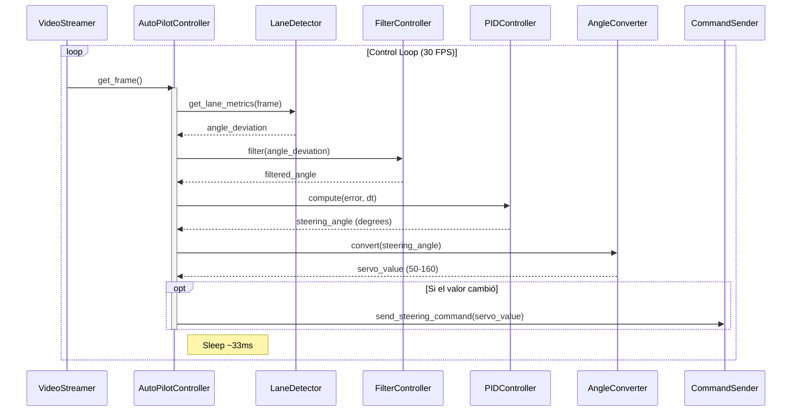

# Documento de Arquitectura de Software (SAD)

**Subsistema:** High-Level Computer Vision & Control ("The Brain")  
**Plataforma:** NVIDIA Jetson Orin Nano / Linux  
**Versión:** 1.0.0  
**Fecha:** Noviembre 2025  

---

## 1. Visión General del Sistema

El módulo **Brain** es el componente de alto nivel encargado de la percepción y navegación autónoma. Se ejecuta sobre un sistema operativo Linux (Ubuntu/L4T) y su función principal es procesar flujos de video en tiempo real para mantener el vehículo en el carril y reaccionar ante señales de tráfico.

A diferencia del controlador de bajo nivel (ESP32), este sistema gestiona lógica compleja, visión artificial y la orquestación de maniobras temporales.

### 1.1 Principios de Diseño
La arquitectura actual se basa en **Controladores Paralelos con Dependencia Directa**.

* **Multithreading:** La detección de carriles y la detección de señales corren en hilos separados para maximizar el uso de los núcleos de la CPU/GPU.
* **Inyección de Dependencias:** El servidor del Dashboard actúa como fábrica, instanciando los controladores y pasando referencias entre ellos.
* **Control Jerárquico Directo:** El subsistema de Señalización tiene autoridad para interrumpir y controlar al subsistema de Navegación (Autopilot).

---

## 2. Vista Estructural (Componentes)

El sistema se organiza en módulos funcionales que abstraen la visión, la lógica de control y el hardware.

### 2.1 Estructura de Directorios y Módulos

```text
brain/
├── dashboard/                       # Servidor Web y UI de control
│   ├── static/                      # Archivos estáticos (CSS, JS, Iconos)
│   ├── templates/                   # Plantillas HTML (dashboard.html)
│   └── dashboard_server.py          # ENTRY POINT: Inicializa controladores y servidor Flask
├── lane_detection/                  # Subsistema de Navegación Autónoma
│   ├── angle_converter.py           # Conversión de ángulo de dirección a valores PWM servo
│   ├── autopilot_controller.py      # Controlador principal (Hilo de control PID)
│   ├── filter_controller.py         # Filtro de media móvil para suavizar dirección
│   ├── lane_detector.py             # Procesamiento de imagen OpenCV (líneas, bird-view)
│   └── pid_controller.py            # Implementación del algoritmo PID
├── sign_vision/                     # Subsistema de Detección de Señales
│   ├── strategies/                  # Implementación del Patrón Strategy
│   │   ├── base_strategy.py         # Clase abstracta con lógica de validación (distancia/confianza)
│   │   ├── intersection_strategy.py # Maniobra manual para intersecciones
│   │   └── stop_strategy.py         # Maniobra de parada y espera
│   ├── weights/                     # Archivos de modelos YOLO (.pt, .engine)
│   ├── sign_controller.py           # Controlador de lógica de señales (Hilo de decisión)
│   └── sign_detector.py             # Inferencia YOLO y cálculo de distancias
├── camera/                          # Módulo de abstracción de hardware de cámara
│   ├── camera_config.py             # Utilidades para selección de cámara según SO
│   ├── realsense_streamer.py        # Driver para Intel RealSense (RGB + Depth)
│   └── video_streamer.py            # Driver genérico para Webcam y streaming MJPEG
├── command_sender.py                # Interfaz de bajo nivel para comunicación Serial (UART) con ESP32
```

### 2.2 Diagrama de Clases y Relaciones


---

## 3. Subsistema Dashboard & Orquestación (`brain/dashboard`)

El módulo Dashboard actúa como el **"Centro de Mando"** y punto de entrada (Entry Point) de la aplicación. Combina funciones de inicialización del sistema, interfaz de usuario y pasarela API.

### 3.1 Responsabilidades Críticas
1.  **Bootstrapping (Arranque):** Al iniciar, detecta y conecta automáticamente el hardware disponible (Cámara RealSense o WebCam, Puerto Serial ESP32).
2.  **Inyección de Dependencias:** Instancia los controladores (`AutoPilotController` y `SignController`) y vincula las referencias cruzadas necesarias para que las maniobras funcionen.
3.  **Telemetría en Tiempo Real:** Utiliza **Server-Sent Events (SSE)** para enviar datos de sensores (velocidad, ángulo, logs) al navegador sin recargas.

### 3.2 Componentes del Servidor (`dashboard_server.py`)
El backend está construido sobre **Flask** y gestiona:

* **Rutas de Control (API REST):**
    * `/autopilot/start` | `/autopilot/stop`: Gestión del hilo de navegación.
    * `/api/pid/update`: Permite la sintonización de constantes PID (`Kp`, `Ki`, `Kd`) en tiempo de ejecución ("Hot-Tuning").
* **Streaming de Video:** Expone la ruta `/video_feed` que sirve frames MJPEG. Permite cambiar dinámicamente entre vistas de depuración (Cámara cruda, Vista de Pájaro, Máscaras de detección).

### 3.3 Interfaz de Usuario (Frontend SPA)
La interfaz (`dashboard.html`) es una Single Page Application que ofrece:
* **Visualización:** Feed de video con superposiciones gráficas (bounding boxes, líneas de carril).
* **Control Manual/Ajuste:** Sliders para modificar la agresividad del PID y la zona muerta en tiempo real.
* **Consola de Eventos:** Log en vivo de las decisiones del sistema (ej. "Stop Sign Detected", "Obstacle Avoidance Active").

---

## 4. Lógica de Ejecución

### 4.1 Hilo de Navegación (AutoPilot)
* **Frecuencia:** ~30 Hz.
* **Responsabilidad:** Procesar imagen -> Calcular error de carril -> PID -> Enviar comando UART.
* **Estado:** Puede ser **Pausado** por el controlador de señales para ceder el control del hardware.

### 4.2 Hilo de Señalización (SignVision)
* **Frecuencia:** ~15-20 Hz (Limitado por inferencia YOLO).
* **Responsabilidad:** Detectar objetos y ejecutar **Estrategias** de maniobra que toman control exclusivo del vehículo.

---

## 5. Flujos de Comportamiento

### 5.1 Flujo Normal: Seguimiento de Carril
El vehículo opera en modo autónomo estándar.



### 5.2 Flujo de Interrupción: Detección de Señal
Cuando se detecta una señal compleja, el sistema de visión toma el control.

```mermaid
sequenceDiagram
    autonumber
    participant Sign as SignController
    participant Strat as EnterIntersectionStrategy
    participant Auto as AutoPilotController
    participant Serial as CommandSender

    Note over Sign: Detección: INTERSECTION<br/>Distancia < activation_distance

    Sign->>Sign: Select strategies['intersection']
    Sign->>Strat: execute(detection)
    activate Strat
    
    rect rgb(60, 20, 20)
        note right of Strat: 1. Pausa de Seguridad
        Strat->>Auto: pause()
        Note over Auto: Loop continúa pero omite<br/>cálculo PID y envío UART
    end

    rect rgb(20, 60, 20)
        note right of Strat: 2. Maniobra Ciega (Time-Based)
        %% Fase 1: Entrar recto
        Strat->>Serial: send_steering(105) (Recto)
        Strat->>Serial: send_speed(15)
        Note right of Strat: Sleep 1.5s
        
        %% Fase 2: Girar
        Strat->>Serial: send_steering(60) (Derecha)
        Note right of Strat: Sleep 3.5s
    end

    rect rgb(20, 20, 60)
        note right of Strat: 3. Retorno de Control
        Strat->>Auto: resume()
        Note over Auto: Reset PID & Filter<br/>Reactiva envío UART
    end
    
    deactivate Strat
    Sign->>Sign: Cooldown check (start timer)
```



---

## 6. Evolución de la Arquitectura (Roadmap)

La arquitectura actual (v1.0) ha demostrado ser eficaz para la validación de algoritmos de visión y la implementación rápida de nuevas maniobras. Proporciona una base funcional sólida para el desarrollo actual. Sin embargo, para escalar hacia comportamientos autónomos más complejos, se ha trazado una ruta de evolución hacia la versión 2.0.

### 6.1 Fortalezas del Diseño Actual
* **Encapsulamiento de Visión:** Los algoritmos de detección operan en módulos aislados.
* **Flexibilidad en Maniobras:** El **Patrón Strategy** permite agregar nuevas lógicas fácilmente.
* **Observabilidad:** El Dashboard actúa como una herramienta de telemetría y control vital para el desarrollo.

### 6.2 Oportunidades de Optimización
Para mejorar la escalabilidad y robustez del sistema, se han identificado las siguientes áreas de mejora estructural:

1.  **Desacoplamiento de Flujo de Control:** Actualmente existe una interacción directa (*Peer-to-Peer*) donde el subsistema de señales gestiona al autopiloto. Una arquitectura jerárquica eliminaría esta dependencia circular.
2.  **Centralización de Autoridad:** Mover la responsabilidad de la ejecución de maniobras desde el subsistema de detección hacia un orquestador central mejoraría la adherencia al *Principio de Responsabilidad Única*.
3.  **Formalización del Estado:** La transición de un estado implícito (basado en pausas) a una **Máquina de Estados Finita** explícita y centralizada proporcionará mayor determinismo en situaciones de conflicto.

> **Nota:** Se ha redactado la propuesta **`docs/v2.0.0/REFACTOR_PROPOSAL.md`** para migrar hacia una arquitectura de **Orquestador Central (VehicleController)** en la versión 2.0.0, transformando a los subsistemas de visión en sensores sin estado y eliminando las interacciones laterales entre ellos.
