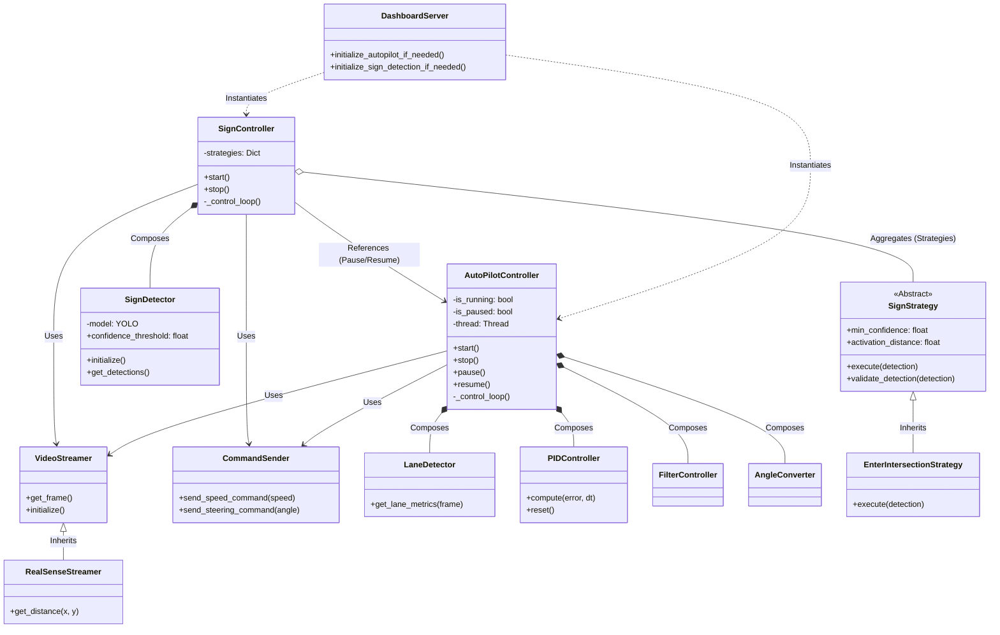

# Diagrama de Clases del Sistema "Brain"

## Explicación de Relaciones

*   **Composición (`*--`)**: El controlador es "dueño" del componente (ej. `AutoPilotController` crea y posee su `PIDController`).
*   **Agregación (`o--`)**: El controlador tiene una colección de objetos (ej. `SignController` tiene un diccionario de `Strategies`).
*   **Uso/Asociación (`-->`)**: El controlador utiliza un recurso compartido (ej. `VideoStreamer`, `CommandSender`).
*   **Referencia (`-->`)**: `SignController` conoce a `AutoPilotController` para poder pausarlo (esta es la dependencia que queremos refactorizar en el futuro).

