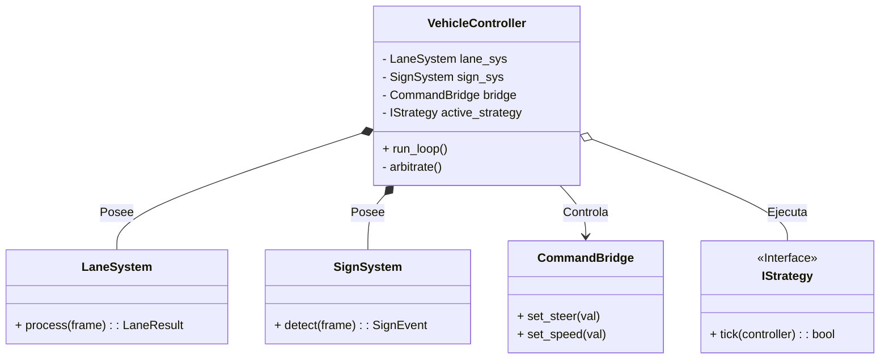

# Documento de Arquitectura de Software (SAD)

**Subsistema:** High-Level Autonomous Controller ("The Brain")  
**Plataforma:** NVIDIA Jetson Orin Nano / Linux  
**Versión:** 2.0.0 (Refactor Implementation)  
**Fecha:** Noviembre 2025  

---

## 1. Visión General del Sistema

El **High-Level Autonomous Controller** (v2.0) representa la evolución de la arquitectura de navegación hacia un modelo de **Orquestación Centralizada**. Se ejecuta sobre la plataforma NVIDIA Jetson Orin Nano y actúa como el cerebro único del vehículo.

### 1.1 Objetivos del Refactor (Principios de Diseño)
Esta versión elimina el acoplamiento "peer-to-peer" de la versión 1.0 para adoptar una jerarquía estricta.

* **Single Source of Truth (Fuente Única de Verdad):** Un único componente (`VehicleController`) conoce el estado global del vehículo.
* **Stateless Sensors (Sensores sin Estado):** Los subsistemas de visión (`LaneSystem`, `SignSystem`) ya no toman decisiones ni controlan el flujo; se limitan a procesar frames y retornar datos estructurados.
* **Arquitectura de Supresión (Subsumption):** La lógica de decisión prioriza capas de comportamiento: *Seguridad > Maniobra Activa > Navegación Base*.

---

## 2. Vista Estructural (Componentes)

La topología cambia de una red de controladores interconectados a una estructura en estrella.

### 2.1 Estructura de Directorios y Módulos

```text
brain/
├── core/                    # NÚCLEO DEL SISTEMA (Nuevo)
│   ├── vehicle_controller.py    # MAIN LOOP & ORCHESTRATOR
│   ├── decision_logic.py        # Reglas de arbitraje
│   └── strategies/              # Maniobras encapsuladas
│       ├── base_strategy.py
│       ├── stop_sequence.py
│       └── turn_sequence.py
│
├── perception/              # SUBSISTEMAS DE VISIÓN (Stateless)
│   ├── lane_system.py           # Procesamiento de carril (retorna ángulo)
│   ├── sign_system.py           # Detección YOLO (retorna eventos)
│   └── camera/                  # Drivers de hardware
│
├── communication/           # PUENTE DE HARDWARE
│   └── command_bridge.py        # Cliente UART para ESP32
│
└── main.py                  # Entry Point
```

### 2.2 Diagrama de Clases (Arquitectura Lógica)

El `VehicleController` compone a los sistemas de percepción y utiliza estrategias. No hay líneas de comunicación directa entre `LaneSystem` y `SignSystem`.



---

## 3. Lógica de Decisión (El Bucle Principal)

El sistema opera en un bucle infinito ("The Decision Loop") que procesa cada frame de video. La lógica de control ya no está dispersa en hilos paralelos que compiten, sino centralizada en un proceso secuencial determinista.

### 3.1 Jerarquía de Arbitraje
En cada ciclo (`tick`), el controlador decide qué acción tomar basándose en la siguiente prioridad:

1.  **Capa de Emergencia:** ¿Se perdió la conexión? ¿Obstáculo a < 30cm? -> **STOP**.
2.  **Capa de Estrategia:** ¿Hay una maniobra compleja en curso (ej. girando)? -> **Ejecutar paso de estrategia**. (Se ignora el carril).
3.  **Capa de Eventos:** ¿Se acaba de detectar una señal crítica (ej. PARE)? -> **Iniciar Estrategia**.
4.  **Capa de Navegación:** Si no ocurre nada de lo anterior -> **Seguir Carril (PID)**.

### 3.2 Diagrama de Secuencia: Un Ciclo de Decisión

```mermaid
sequenceDiagram
    autonumber
    participant Loop as Main Loop
    participant BRAIN as VehicleController
    participant VISION as Perception Layer
    participant STRAT as Active Strategy
    participant ESP as CommandBridge

    Loop->>BRAIN: Tick (Nuevo Frame)
    
    rect rgb(30, 30, 40)
        note right of BRAIN: 1. Fase de Percepción
        BRAIN->>VISION: LaneSystem.process()
        BRAIN->>VISION: SignSystem.detect()
        VISION-->>BRAIN: {Lane: -5°, Sign: STOP_SIGN}
    end

    %% Quitamos el rect envolvente aquí para evitar el error de parsing
    note right of BRAIN: 2. Fase de Arbitraje
    
    alt Hay Estrategia en curso?
        BRAIN->>STRAT: tick()
        STRAT->>ESP: send_commands()
    
    else Nueva Señal Crítica (STOP)?
        BRAIN->>BRAIN: Cargar StopStrategy
        BRAIN->>STRAT: start()
        STRAT->>ESP: send_speed(0)
        
    else Conducción Normal (Default)
        BRAIN->>BRAIN: Usar datos de Carril
        BRAIN->>ESP: send_steer(-5)
        BRAIN->>ESP: send_speed(150)
    end
```

---

## 4. Gestión de Maniobras (Pattern Strategy)

Las maniobras complejas (que requieren temporalidad o secuencias ciegas) se encapsulan utilizando el **Patrón Strategy**.

### 4.1 Definición de Estrategias
Las estrategias son máquinas de estados finitos pequeñas que toman control temporal del actuador.

* **`StopSequenceStrategy`**:
    * *Estado 1:* Frenar (Speed 0).
    * *Estado 2:* Esperar 3 segundos (Timer).
    * *Estado 3:* Acelerar (Speed 150) por 1.5 segundos (ignorando carriles).
    * *Fin:* Devolver control al orquestador.

* **`IntersectionTurnStrategy`**:
    * Ejecuta una secuencia "Open Loop" (ciega) basada en tiempo u odometría para realizar giros de 90 grados donde las líneas del carril desaparecen.

---

## 5. Interfaces Externas

### 5.1 Comunicación con ESP32 (Salida)
El `VehicleController` actúa como el **Productor Único**. A diferencia de la v1.0, no hay condición de carrera (Race Condition) sobre el puerto serial porque solo un hilo escribe en él.

* **Protocolo:** UART @ 921600 baud.
* **Comandos:** `CONTROL:SET_STEER`, `CONTROL:SET_SPEED`, `LIGHTS:SET_MODE`.

### 5.2 Entradas de Sensor (Entrada)
* **Cámara:** Acceso unificado vía GStreamer.
* **Configuración:** Los umbrales de visión (HSV para carriles, Confianza para YOLO) se cargan desde un archivo `config.yaml` al inicio.

---

## 6. Stack Tecnológico

* **Lenguaje:** Python 3.10
* **Visión:**
    * `Ultralytics YOLOv8` (Inferencia TensorRT).
    * `OpenCV` (CUDA enabled).
* **Concurrencia:** Aunque la lógica es secuencial, el fetching de la cámara y la inferencia de YOLO pueden correr en hilos separados (`multiprocessing`) para mantener el Main Loop a 30 FPS estables.

---

### Historial de Migración (v1.0 -> v2.0)

| Característica | Versión 1.0 (Legacy) | Versión 2.0 (Actual) |
| :--- | :--- | :--- |
| **Control** | Distribuido (Peer-to-Peer) | Centralizado (Orchestrator) |
| **Dependencias** | SignController controla AutoPilot | Independientes (Decoupled) |
| **Gestión de Estado** | Implícito (Pausado/Activo) | Explícito (State Machine) |
| **Seguridad de Hilos** | Riesgo de Race Condition | Thread-Safe por diseño |
